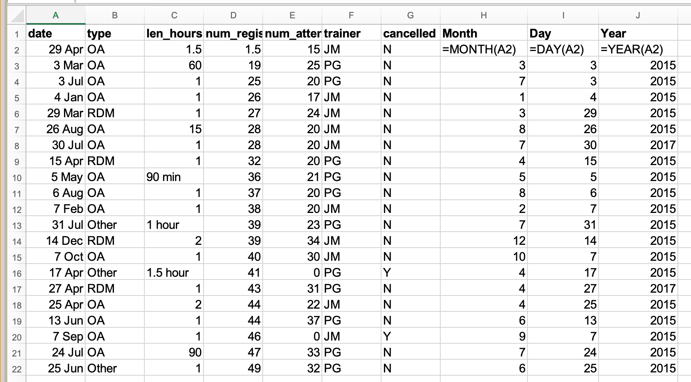

Dates in spreadsheets are often stored in one column. Whilst this seems the
most natural way to enter dates, it actually is not a good
practice. A spreadsheet application may display the dates
correctly (for readability) but how it actually handles
and stores the dates may be problematic.
This can cause problems if the date displayed does not fully represent the information that the spreadsheet application is using, such as when the year is not displayed; in addition, date information may be changed when data is converted to different spreadsheet formats, such as between `.xlsx` and `.csv`, or opened in different applications.

## Date formats in spreadsheets

Spreadsheet applications employ numerous features that facilitate the processing and display of date information. While these features often make date information more easily readable, the underlying data handling techniques can create data ambiguity in a variety of ways. The figure below illustrates some of the ways that the display of information representing the same date can vary. Column A is the information as entered by a user, and the following columns show different ways that the information may be displayed.


> ## How can these features create data ambiguity?
>
> Ideally, data should be as unambiguous as possible.
>
> * What do you notice about the display of the date information above? What information changes between the columns?
> * What aspects of the display lack specificity and may introduce ambiguity?
{: .discussion}

### Displaying dates

The figure above shows that ambiguity may creep into your data in numerous ways depending on the format you chose when you entered your data.
If you’re not fully aware of these ambiguities, you may find that Excel will interpret your data in unexpected ways later. 

The display format of each cell can be modified. To change the display in Excel, navigate to the Format menu and choose "Cells...". In the "Format Cells" dialog box, you can select a Date format and choose various display outputs (some are shown in the above figure). In the dialog box, you can also choose to format the cell as a number or text. It may be useful to format the cell as one of these other datatypes, since as we will discuss next, the spreadsheet program understands the date information as a number.

### Storing dates

Spreadsheet applications, including Excel, **store dates as a number** (see Column I in the figure above). The application developers chose a single day to designate as day zero, and each subsequent day is incremented by a value of one. Essentially, Excel counts the days from a default of December 31, 1899. Thus, July 2, 2014 is stored as the serial number `41822`. Not all applications or operating systems use the same date for day zero.

Understanding the spreadsheet program uses serial numbers to process
dates can be useful in some circumstances. Using
the above functions, you can easily add days, months or years to a given date.
Say you had a sampling plan where you needed to sample every thirty seven days.
In another cell, you could input the following:

~~~
=B2+37
~~~
{: .source}

This would display:

~~~
8-Aug
~~~
{: .output}

This happens because Excel processes the date July 2, 2014 as the number `41822`.
Adding `41822 + 37` results in `41859`
which Excel interprets as August 8, 2014. The program retains the format (for the most
part) of the cell that is being operated upon (unless you did some sort of
formatting to the cell before, and then all bets are off). Month and year
rollovers are internally tracked and applied.

> ## Working with historical dates (before 1900)
>
> Excel is unable to parse dates from before 1899-12-31, and will thus leave these untouched.  If you’re mixing historic data
> from before and after this date, Excel will translate only the post-1900 dates into its internal format, thus resulting in mixed data.
> If you’re working with historic data, be extremely careful with your dates!
>
> Excel also entertains a second date system, the 1904 date system, as the default in Excel for Macintosh. This system will assign a
> different serial number than the [1900 date system](https://support.microsoft.com/en-us/help/214330/differences-between-the-1900-and-the-1904-date-system-in-excel). Because of this,
> [dates must be checked for accuracy when exporting data from Excel](http://uc3.cdlib.org/2014/04/09/abandon-all-hope-ye-who-enter-dates-in-excel/) (look for dates that are about 4 years off).
{: .callout}

## Useful spreadsheet functions for working with date information

Let's take a look at some functions that will help us work with date information in spreadsheet applications.
Please remember that **functions that are valid for a given
spreadsheet program (be it LibreOffice, Microsoft Excel, OpenOffice.org,
Gnumeric, etc.) are usually guaranteed to be compatible only within the same
family of products.** So, if you will later need to export the data and need to
conserve the timestamps you should consider recording date information using one of the solutions discussed below.

If a date is entered in one column, we can use functions to extract information from that column into other columns. For example, it can be useful to display the specific information about the year, month, and day. Conversely, these functions can convert supplied numerical values from numbers into dates. Date-related functions allow us to convert date values from the stored numerical value to a readable display value, make calculations between date values, and also to extract the date values so that they do not change as data is transformed or exchanged between new users and systems. 

The table below outlines a few useful date-related functions and how they differ between some of the widely used spreadsheet applications.

Action of function | Excel | LibreOffice | OpenOffice
--- | --- | --- | --- |
Return the year number represented in the referenced cell value | ```YEAR()``` | ```YEAR()``` | |
Return the month number represented in the referenced date serial number | ```MONTH()``` | ```MONTH()``` |  |
Return the day of the month represented in the referenced date serial number | ```DAY()``` | ```DAY()``` | |
Calculate and display a date based on supplied year, month, and day values | ```DATE(Year, Month, Day)``` | ```DATE(Year; Month; Day)``` | |
Return the serial number for date information supplied as a string | ```DATEVALUE()``` | ```DATEVALUE("Text")``` |  |
Return the serial number of the current system date | ```NOW()``` | ```NOW()``` |  |

> ## Using Date-Related Functions (Excel)
>
> Pulling month, day, and year out of dates:
>
> - In the `Dates` tab of your Excel file we summarized training data from 2015. There's a `date` column.
> - Extract month, day and year from the date to three new columns. 
>
> Tip: Make sure the new column is formatted as a number and not as a date. Change the function to correspond to each row: i.e., =MONTH(A3), =DAY(A3), =YEAR(A3) for the next row.
>
> > ## Solution
> >
> > You can see that even though you wanted the year to be 2015 for all entries, your spreadsheet program interpreted two entries as 2017, the year the data was entered, not the year of the workshop.
> > 
> {: .solution}
{: .challenge}

### Adding dates

Adding years and months and days is slightly trickier because we need to make
sure that we are adding the amount to the correct entity.

- First we extract the single entities (day, month, or year)
- We can then add values to do that
- Finally the complete date string is reconstructed using the `DATE()` function.

**Note:** Time values raise similar challenges. Seconds can be directly
added but to add hour and minutes you will need to make sure
that quantities are added to the correct entities.

> ## Exchanging Date Information between Formats
>
> What happens to the dates in the `dates` tab of our workbook if we save this sheet in Excel (in `csv` format) and then open the file in a plain text editor (like TextEdit or Notepad)? What happens to the dates if we then open the `csv` file in Excel?
>
> > ## Solution
> >
> > - Click to the `dates` tab of the workbook and double-click on any of the values in the `Date collected` column. Notice that most of the dates display with the year 2015 and two are 2017.
> > - Select `File -> Save As` in Excel and in the drop down menu for file format select `CSV UTF-8 (Comma delimited) (.csv)`. Click `Save`.
> > - You will see a pop-up that says 'This workbook cannot be saved in the selected file format because it contains multiple sheets.' Choose `Save Active Sheet`.
> > - Navigate to the file in Finder (Mac) or Explorer (Windows). Right click and select `Open With`. Choose a plain text editor application and view the file. Notice that the dates display as month/day without any year information.
> > - Now right click on the file again and open with Excel. Notice that the dates display with the current year, not 2015.
> > As you can see, exporting data from Excel and then importing it back into Excel fundamentally changed the data once again!
> {: .solution}
{: .challenge}

## Advantages of Alternative Date Formatting

### Storing dates as YEAR, MONTH, DAY {#day}

Storing dates in YEAR, MONTH, DAY format helps remove this ambiguity. Let's look at this issue a bit closer.

For instance, in a spreadsheet recording insect counts every few days in July 2001, the data displayed as shown below in Column A. Note that the data was recorded in only one cell in each row, and the data only included reference to the month and day (`<MONTH>-<DAY>`).


When interpreted in Excel, it appears that the observations had been recorded in 2010, 2014, 2015 and 2017 even though our records state that the data was gathered in 2001.

Entering dates in one cell is helpful but due to the fact that the spreadsheet programmes may interpret and save the data in different ways (doing that somewhat behind the scenes), there is a better practice.

In dealing with dates in spreadsheets, we recommend separating **date data into separate fields** (day, month, year), which will eliminate any chance of ambiguity.

### Storing dates as YEAR, DAY-OF-YEAR {#doy}

There is also another option:
You can also store dates as year, and day of year (DOY). Why? Because depending on your
question, this might be what's useful to you, and there is practically no possibility for ambiguity creeping in.

Statistical models often incorporate year as a factor, to account for year-to-year variation, and DOY can be used to measure the passage of time within a year.

So, can you convert all your dates into DOY format? Well, in Excel, here’s a handy dandy guide:


### Storing dates and times as a single string {#str}

When dealing with dates and times, the best alternative is to convert the date string
into a single string using the `YYYYMMDDhhmmss` format, following the international date standard [ISO 8601](https://en.wikipedia.org/wiki/ISO_8601).
For example the date `March 24, 2015 17:25:35` would
become `20150324172535`, where:

```
YYYY:   the full year, i.e. 2015
MM:     the month, i.e. 03
DD:     the day of month, i.e. 24
hh:     hour of day, i.e. 17
mm:     minutes, i.e. 25
ss:     seconds, i.e. 35
```

Such strings will be correctly sorted in ascending or descending order, and by
knowing the format they can then be correctly processed by the receiving
software.

## Preferred date format

Due to the issues caused by the way that spreadsheet programs handle and display dates, it is safer to store dates with [YEAR, MONTH, DAY](#day) in separate columns or as [YEAR and DAY-OF-YEAR](#doy) in separate columns.
This practice will make your data less ambiguous, will guard
against changes that may be caused if the spreadsheet is opened by other software,
and generally make your data table more accessible and interoperable.

## Resources

Most spreadsheet applications offer more detailed information about working with date and time information. Some of these are referenced below:

* Microsoft Excel [date and time functions reference](https://support.microsoft.com/en-us/office/date-and-time-functions-reference-fd1b5961-c1ae-4677-be58-074152f97b81)
* LibreOffice Date & Time Functions Reference [v. 6.2](https://help.libreoffice.org/6.2/en-US/text/scalc/01/04060102.html)