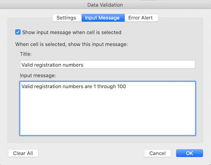
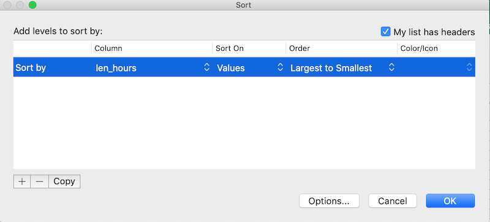

When you have a well-structured data table, you can use several simple
techniques within your spreadsheet to ensure the data you enter is
free of errors. These approaches include techniques that are
implemented **prior to entering data** (**quality assurance**) and
techniques that are used **after entering data to check for errors**
(**quality control**).

# Quality Assurance

Quality assurance stops bad data from ever being entered by checking to see if
values are valid during data entry. For example, if research is being conducted
at sites A, B, and C, then the value V (which is right next to B on the
keyboard) should never be entered. Likewise if one of the kinds of data being
collected is a count, only integers greater than or equal to zero should be
allowed.

To control the kind of data entered into a a spreadsheet we use Data Validation
(Excel) or Validity (LibreOffice Calc), to set the values that can be entered
in each data column.

1. Select the cells or column you want to validate

2. On the `Data` tab select `Data Validation`

   

3. In the `Allow` box select the kind of data that should be in the
   column. Options include whole numbers, decimals, lists of items, dates, and
   other values.

   

4. After selecting an item enter any additional details. For example if you've
   chosen a list of values then enter a comma-delimited list of allowable
   values in the `Source` box.

We can't have half a person attending a workshop, so let's try this
out by setting the `num_registered` column in our spreadsheet to only
allow whole numbers between 1 and 100.

1. Select the `num_registered` column
2. On the `Data` tab select `Data Validation`
3. In the `Allow` box select `Whole number`
4. Set the minimum and maximum values to 1 and 100.

Now let's try entering a new value in the num_registered column that isn't a valid class size. The spreadsheet stops us from entering the wrong value and asks us if we would like to try again.

You can also customize the resulting message to be more informative by entering
your own message in the `Input Message` tab

and allow invalid data to just result in a warning by modifying the `Style`
option on the `Error Alert` tab.

Quality assurance can make data entry easier as well as more robust. For
example, if you use a list of options to restrict data entry, the spreadsheet
will provide you with a drop-downlist of the available items. So, instead of
trying to remember the initials of all your trainers, you can just select the
right option from the list.

# Quality Control

> ## Tip!
>
> Before doing any quality control operations, save your original file with the formulas and a name indicating it is the original data. Create a **separate file** with appropriate naming and versioning, and ensure your data is stored as **values** and not as **formulas**.  Because formulas refer to other cells, and you may be moving cells around, you may compromise the integrity of your data if you do not take this step!
{: .callout}

**readme (README) files:** As you start manipulating your data files, create a readme document / text file to keep track of your files and document your manipulations so that they may be easily understood and replicated, either by your future self or by an independent researcher. Your readme file should document all of the files in your data set (including documentation), describe their content and format, and lay out the organizing principles of folders and subfolders. For each of the separate files listed, it is a good idea to document the manipulations or analyses that were carried out on those data. [Cornell University’s Research Data Management Service Group](https://data.research.cornell.edu/content/readme) provides detailed guidelines for how to write a good readMe file, along with an adaptable template.

## Sorting

**Bad values often sort to bottom or top of the column**. For example, if your data should be numeric, then alphabetical and null data will group at the ends of the sorted data. Sort your data by each field, one at a time. Scan through each column, but pay the most attention to the top and the bottom of a column.
If your dataset is well-structured and does not contain formulas, sorting should never affect the integrity of your dataset.

> ## Exercise
>
> Let's try this with the *Date* tab in our messy spreadsheet. Go to that tab. Select
> **Data** then select **Sort**
>
> Sort by `len_hours` in the order *Largest to Smallest*
>
> - When you do this sort, do you notice anything strange?
>
> - Try sorting by other columns. Anything strange there?
>
>> ## Solution
>>
>> Click the <kbd>Sort</kbd> button on the <kbd>Data</kbd> tab in Excel. A pop-up will appear.
>>
>> The following window will display, choose the column you want to sort as well as the sort order.
>>
>>
>>
>>Note how the odd values sort to the top. The cells containing  “min” or "hour" are   found towards the top. Larger values like 90, 60 and 15 also are sorted so you can evaluate them. This is a powerful way to check your data for outliers and odd values.
>>
> {: .solution}
{: .challenge}

## Conditional formatting ##

Use with caution! But a great way to flag inconsistent values when entering data.

Conditional formatting basically can do something like color code your values by some
criteria or from lowest to highest. This makes it easy to scan your data for outliers. It is nice to be able to do these scans in spreadsheets, but we also can do these
checks in a programming language like Python or R, or in OpenRefine or SQL.

> ## Exercise
>
> 1. Make sure the `num_attended` column is highlighted.
> 1. Go to **Format** then **Conditional Formatting**.
> 1. Apply any 2-Color Scale formatting rule.
> 1. Now we can scan through and different colors will stand out. Do you notice any strange values?
>
>> ## Solution
>> We can see two outlier cells of 0 and can see these two classes were cancled.
>>
>>{: .output}
> {: .solution}
{: .challenge}
