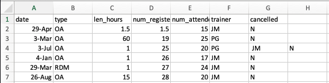

<!-- Materials by: **Jeffrey Hollister**, **Alexander Duryee**, **Jennifer Bryan**, **Daisie Huang**, **Ben Marwick**, **Christie Bahlai**, **Owen Jones**, **Aleksandra Pawlik** -->

## Dealing with commas as part of data values in `*.csv` files ##

In the [previous lesson](../05-exporting-data) we discussed how to export Excel file formats into `*.csv`. Whilst Comma Separated Value files are indeed very useful allowing for easily exchanging and sharing data. 

However, there are some significant problems with this particular format. Quite often the data values themselves may include commas (,). In that case, the software which you use (including Excel) will most likely incorrectly display the data in columns. It is because the commas which are a part of the data values will be interpreted as a delimiter.

Data could look like this:
	
		date,type,len_hours,num_registered,num_attended,trainer,cancelled
    29 Apr,OA,1.5,1.5,15,JM,N
    3 Mar,OA,60,19,25,PG,N
    3 Jul,OA,1,25,20,PG, JM ,N
    4 Jan,OA,1,26,17,JM,N
    29 Mar,RDM,1,27,24,JM,N

In record `3 Jul,OA,1,25,20,PG, JM ,N` the value for *trainer* includes a comma for multiple trainers (`PG, JM`). 
If we try to read the above into Excel (or other spreadsheet programme), we will get something like this:

The value for 'trainer' was split into two columns (instead of being put in one column `F`). This can propagate to a number of further errors. For example, the "extra" column will be interpreted as a column with many missing values (and without a proper header!). 
 
If you want to store your data in `csv` format and expect that your data values may contain commas, you can avoid the problem discussed above by putting the values to be included in the same column in quotes (""). Applying this rule, the data might look like this:

		date,type,len_hours,num_registered,num_attended,trainer,cancelled
    29 Apr,OA,1.5,1.5,15,JM,N
    3 Mar,OA,60,19,25,PG,N
    3 Jul,OA,1,25,20,"PG, JM",N
    4 Jan,OA,1,26,17,JM,N
    29 Mar,RDM,1,27,24,JM,N
	

Now opening this file as a `csv` in Excel will not lead to an extra column, because Excel will only use commas that fall outside of quotation marks as delimiting characters. However, if you are working with an already existing dataset in which the data values are not included in "" but which have commas as both delimiters and parts of data values, you are potentially facing a major problem with data cleaning.

If the dataset you're dealing with contains hundreds or thousands of records, cleaning them up manually (by either removing commas from the data values or putting the values into quotes - "") is not only going to take hours and hours but may potentially end up with you accidentally introducing many errors.

Cleaning up datasets is one of the major problems in many scientific disciplines. The approach almost always depends on the particular context. However, it is a good practice to clean the data in an automated fashion, for example by writing and running a script. The Python and R lessons will give you the basis for developing skills to build relevant scripts. 
